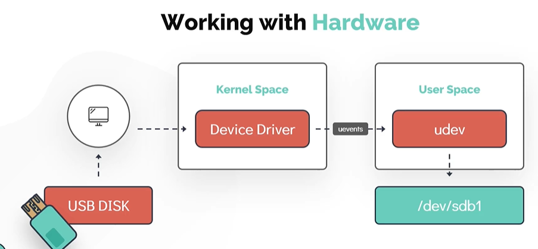
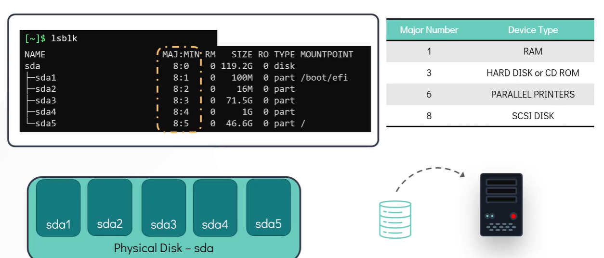

# Working with Hardware

In this section, we will look at how linux works with the hardware resources available to the system and how to make use of kernel modules
- We will look at how linux identifies and manages hardware devices attached to the system
- We will then see ways to list and get detailed information about these devices from the command line.

Lets take an example of **`USB Disk`** be used in the system.
- As soon as the **`USB device`** is attached to the system a corresponding device driver which is part of the kernel space detects the stage change and generates an event. 
- This event which is called **`uevents`** is then sent to the **`User Space`** device manager daemon called **`udev`**. 
- The **`udev`** service is then responsible for dynamically creating a device node associated with the newly attached USB drive in the **`/dev/`** filesystem. 
- Once the process is complete, the newly attached disk should be visible under **`/dev/`** filesystem.



Use **`dmesg`** display messages from the area of kernel called **`Ring Buffer`** . When a linux operating system boots up there were numerous messages generated by the kernel that appear on the display screen. These messages also contain logs from the hardware devices that the kernel detects and provide good indication wheather it is able to configure
```
$ dmesg
$ dmesg | grep -i usb
```

The **`udevadm`** is the management utility for udev which queries the database for device information.
```
$ udevadm info --query=path --name=/dev/sda5
```

The **`udevadm monitor`** listens to the kernel new **`uevents`** upon detecting an event, it prints the details such as the **`device path`** and the **`device name`** on the screen. This command is handy to determine the details of the newly attached or removed device.
```
$ udevadm monitor
```

To list all PCI (Peripheral Component Interconnect) devices that are configured in the system. Examples of PCI devices are **`Ethernet Cards`**, **`RAID Controllers`**, **`Video Cards`** and **`wireless Adaptors`** that directly attached to PCI slots in the motherboard of the computer
```
$ lspci
```
   
   

To list information about **`Block Devices`**
```
$ lsblk
```
   
   

To display detail information about the **`CPU`** such as CPU architecture, cpu op-modes (32 bit, 64 bit) etc.
```
$ lscpu
```

To list available memory in the system. 
```
$ lsmem --summary
```

Another alternate command to see the information about the memory. This command will list total used and free memory.
```
$ free -m
```

To extract detail information about the entire hardware information of the machine
```
$ lshw
```

#### To run commands with root privileges. Not every user can run all the commands in the linux system some commands need to be run as the `root` or the `super-user`. Use **`sudo`** followed by <command> ( input the sudo password ).

```
$ sudo lshw
```